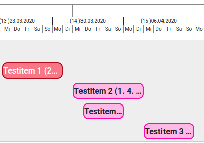
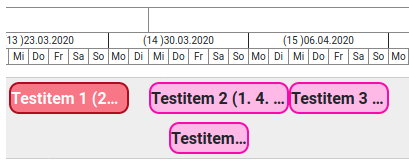
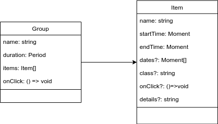

# NgTimeChart

**ng-time-chart is a library which can display durations in a calendar**

* Display durations in a horizontally scrolling calendar. Similar to a Gantt-chart.
* Groups with no active dates in the selected time period are filtered out
* Durations are part of groups and are displayed together
* Durations can have 'active' days which are displayed in a darker color
* Colors can be configured
* Durations are clickable and the function can be passed into the component
* The library displays the duration of an entire year
  * The year can be advanced and regressed
* Library location: `projects/ng-time-chart` directory of this repository
* It is developed using Angular >=6.0.0 and its newly introduced ng g library schematics.

## Examples/Demo
* A simple Example can be found under projects/ng-time-chart-showase directory of this repository.
* The example is deployed: [Demo Link](https://puzzle.github.io/ng-time-chart/)

## Installation
`npm i @puzzleitc/ng-time-chart`

## Usage
**1. Register the NgTimeChartModule**

`import { NgTimeChartModule } from 'ng-time-chart';`

**2. Use the component (ng-time-chart) in your component.**

**2.1 create a group**
```typescript
new Group(
        'Group 0',
        [
          {
            name: 'Timeframe with 4 active days and color set',
            startTime: moment('2019-02-12'),
            endTime: moment('2019-05-23').
            class: 'my-class-a',
            dates: [
              moment('2019-03-18'),
              moment('2019-03-19'),
              moment('2019-03-23'),
              moment('2019-03-24')
            ]
          },
          {
            name: 'Timeframe in default color',
            startTime: moment('2018-12-11'),
            endTime: moment('2019-03-02')
          }
        ],
        () => console.log('clicked'),
      )
```

**2.2 Pick a layout strategy**
The items within a group can be laid out using two different methods:
- **Stacked**: Items in a group are stacked in the order that they are in the group. Every item has its own row.



- **Tiled**: If possible, items of a group are displayed in the same row. This does not preserve the order of the items in the group but saves on space.



Select the appropriate LayoutStrategy by either passing `LayoutStrategy.Stacked` or `LayoutStrategy.Tiled` to ng-time-chart.

```typescript
public layoutStrategy: LayoutStrategy = LayoutStrategy.Tiled
```

**2.3 Add HTML Code**
```angular2html
<ng-time-chart [groups]="groups" [layoutStrategy]="layoutStrategy">

</ng-time-chart>
```

`ng-time-chart` takes all the available space from the parent element. If wrapped in a smaller element vertical and horizontal scrolling is available

**2.4 Add scss style**

In your `styles.scss`, add the style definition for the classes you have added in the item. In this case it is `my-calss-a`
```scss
.my-class-a {
  border-color: #CB561E;
  background-color: lighten(#CB561E, 35%);

  .blockade-day {
    background-color: #CB561E;
  }
}
```

**3. The visible period can be configured by setting endDate and startDate.**
 
If the values are changed the calendar will be redrawn. If a date is set, switching years is disabled.

```typescript
  startDate = moment('2019-10-10');
  endDate = moment('2020-03-10');
```

```angular2html
<ng-time-chart [groups]="groups" [startDate]="startDate" [endDate]="endDate">

</ng-time-chart>
```

## Data model

### Group
This is a grouping of several items.
- _name_: The name of the group as displayed in the chart
- _duration_: The calculated duration of the whole group. It is automatically calculated as the difference between the earliest start time and the latest end time of all items passed to the constructor.
- _items_: The items belonging to the group.
- _onClick_: The optional action to execute when the user clicks on the group.

### Item
This represents a bar in the time chart.
- _name_: The name of the item.
- _startTime_: The start date of the item. This is represented in Momentjs
- _endTime_: The end date of the item.
- _class_: The optional css-class of the item.
- _onClick_: The optional action to take when the user clicks the item in the chart.
- _details_: Additional information for the item. These are displayed when the mouse hovers over the item in the calendar.
 
## Known Issues

- `Warning: Type LayoutStrategy is not assignable to type LayoutStrategy`
This is a warning displayed by IntelliJ. We have no idea why this is happening. It does not seem to cause any actual problems in code however.
